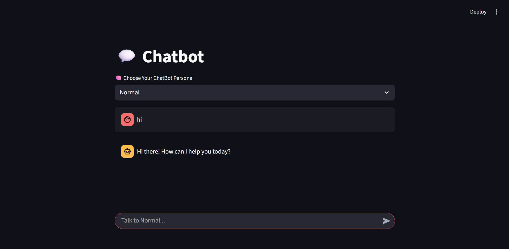

# 💬 Streamlit Persona Chatbot

A **fun, multi-persona chatbot** built with **Streamlit** and **LangChain**, powered by **Google Gemini (Generative AI)**.  
Switch personas on the fly — from a savage **RoastBot** to a poetic **ShakespeareBot**, a cheeky **FlirtBot**, or even a fully emoji-speaking **EmojiBot**.  

---

## ✨ Features
- 🧠 **Multiple Personas**:
  - 🤖 **Normal** – Helpful, clear, concise answers  
  - 🔥 **RoastBot** – Savage, dark-humored, no-filter roasts  
  - 🎭 **ShakespeareBot** – Shakespearean English responses  
  - 😂 **EmojiBot** – Replies only using emojis  
  - ☠️ **PirateBot** – “Arrr, matey!” pirate-style talk  
  - 📖 **Pokedex** – Pokémon descriptions like the Pokédex  
  - 💘 **FlirtBot (desperate)** – Over-the-top, inappropriate flirting  
  - 😏 **FlirtBot (normal)** – Cheesy but fun pickup lines  

- 🗂️ **Separate memory per persona**  
- ⚡ **Fast responses** via **Gemini 2.5 Flash**  
- 🖥️ **Streamlit chat UI** with message history  

---

## 📸 Demo

---

## 🛠️ Setup

### 1. Clone the repository

git clone https://github.com/yourusername/persona-chatbot.git
cd persona-chatbot

### 2. Create a virtual environment (recommended)

python -m venv venv
source venv/bin/activate  # Mac/Linux
venv\Scripts\activate     # Windows

### 3. Install dependencies

pip install -r requirements.txt

### 4. Set your Gemini API Key
Get a key from Google AI Studio and set it as an environment variable

export GEMINI_API_KEY="your_api_key_here"   # Mac/Linux
setx GEMINI_API_KEY "your_api_key_here"     # Windows (PowerShell)
Or create a .streamlit/secrets.toml file:

GEMINI_API_KEY = "your_api_key_here"

### 5. Run the app

streamlit run app.py

## 📦 Requirements

### requirements.txt:

nginx
Copy code
streamlit
langchain
langchain-google-genai

## 🚀 Deployment

Deploy on Streamlit Cloud
Push this repo to GitHub

Go to Streamlit Cloud

Select your repo & branch

Add GEMINI_API_KEY to Secrets Manager

### Deploy 🎉

Deploy on Hugging Face Spaces
Create a new Space (Streamlit)

Upload repo files

Add GEMINI_API_KEY as a secret

Enjoy your hosted chatbot

## 🤝 Contributing
Want to add a new persona?

Open app.py

Add a new entry to the personas dictionary

Submit a Pull Request 🚀

## ⭐ Support
If you like this project:

🌟 Star this repo

🪄 Fork it & build your own persona

💡 Suggest new personas in Issues